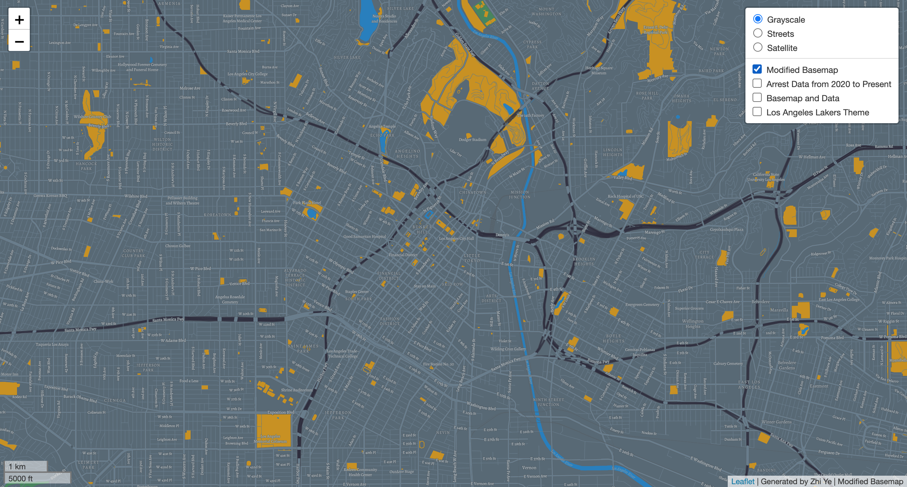
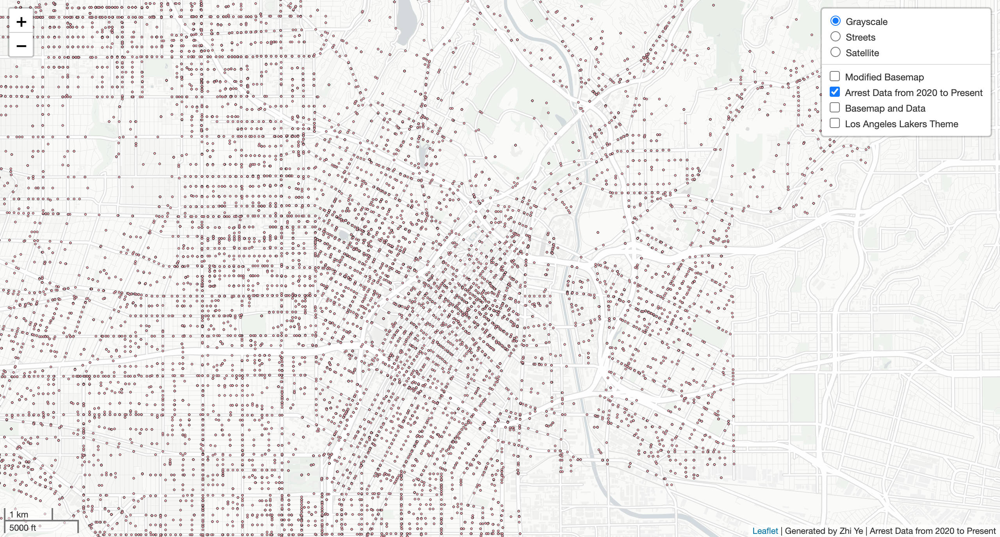
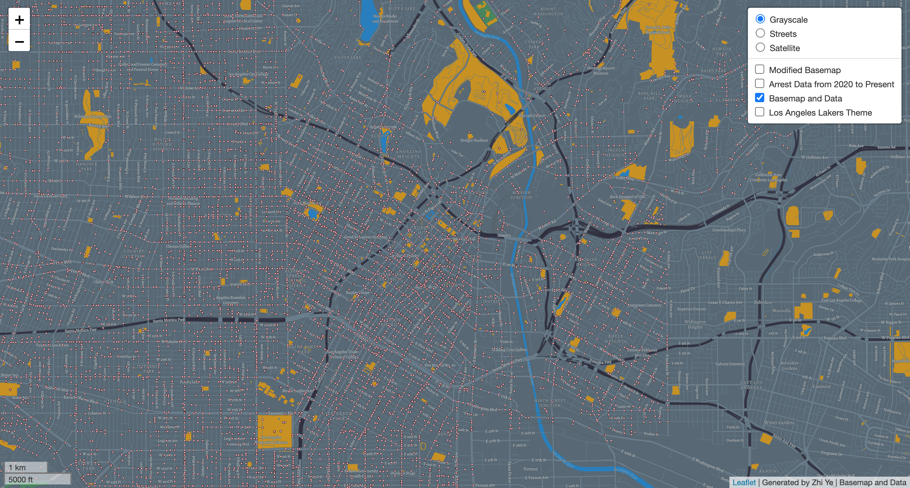
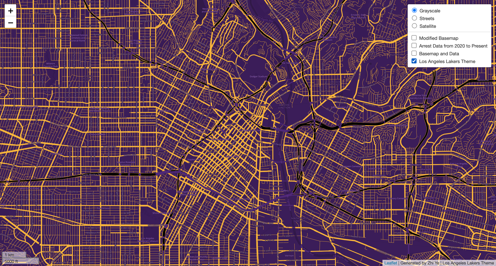

# Los Angeles Tile Sets Map

This repository contains the neccessary files to create and display an interactive web map of four different tiles of Los Angeles, CA. Below will show each of the four tile layers with an image and information regarding its description, geographic area of focus, and zoom levels. Lastly, the interactive map can be viewed at: https://zzhiye.github.io/los-angeles/index.html

## Tile 1 - Modified Basemap

* Description of Tile: The Modified Basemap showcases Los Angeles while highlighting major roadways/highways, bodies of water, landuse, and parkland.
* Geographic Area of Focus: Los Angeles, CA
* Zoom Levels: Max zoom - 14; Min zoom - 10

## Tile 2 - Arrest Data from 2020 to Present

* Description of Tile: This tile showcases arrest incidents in the City of Los Angeles from 2020 to present.
* Geographic Area of Focus: Los Angeles, CA
* Zoom Levels: Max zoom - 14; Min zoom - 10

## Tile 3 - Basemap with Data

* Description of Tile: The Basemap with Data tile utilizes the Modified Basemap from Tile 1 and Arrest Data from 2020 to Present from Tile 2.
* Geographic Area of Focus: Los Angeles, CA
* Zoom Levels: Max zoom - 14; Min zoom - 10

## Tile 4 - Los Angeles Lakers Theme

* Description of Tile: This tile embodies a map theme relevant to me, which I chose to make a Los Angeles Lakers themed map.
* Geographic Area of Focus: Los Angeles, CA
* Zoom Levels: Max zoom - 14; Min zoom - 10
